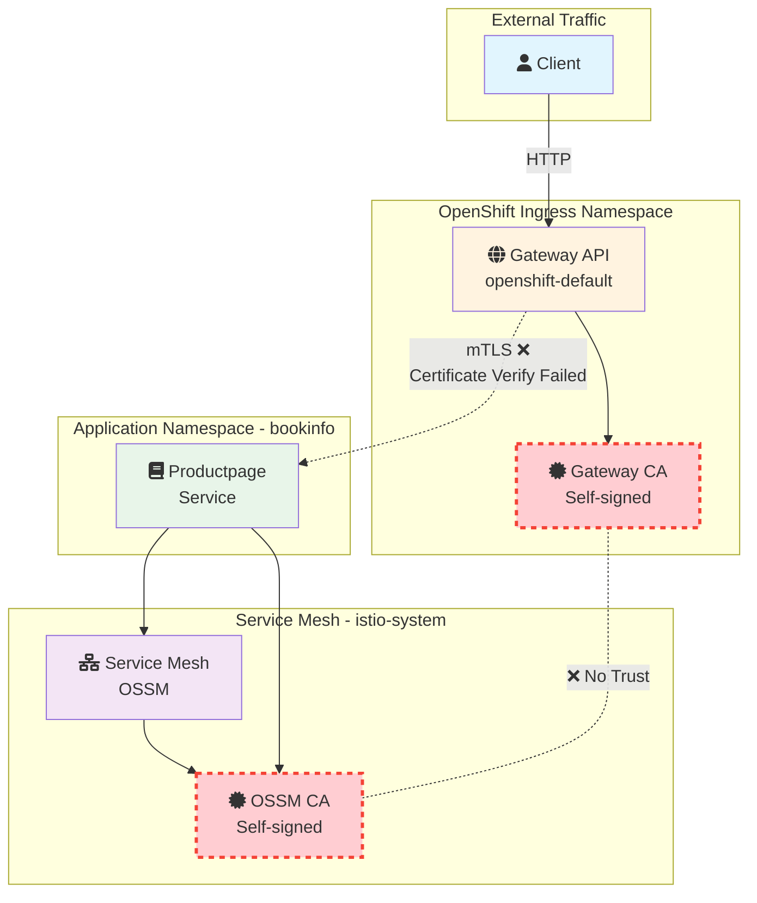
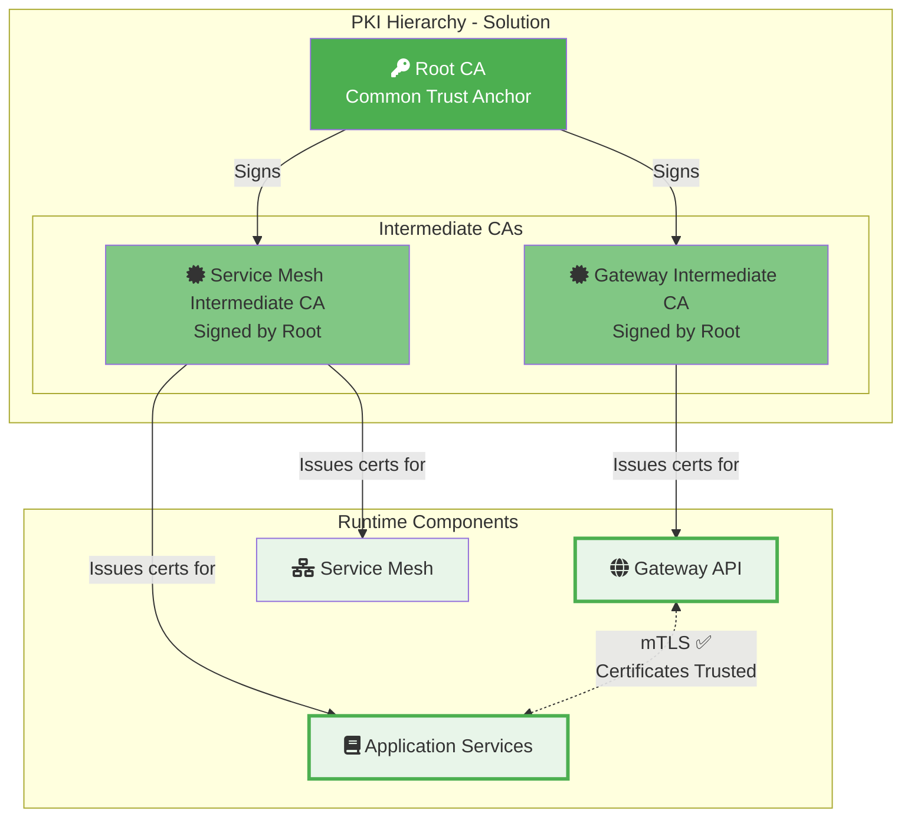

# Integrating OpenShift Gateway API with OpenShift Service Mesh

## When Two Service Meshes Meet

In the evolving landscape of Kubernetes networking, the Gateway API represents the future of ingress management, while Istio Service Mesh continues to provide robust service-to-service communication. But what happens when you need to integrate Kubernetes's native Gateway API implementation with a service mesh? In this unofficial write-up we share a real-world challenge we hit and the workaround we prototyped.

>
> **Quick Navigation**: If you already have OpenShift Service Mesh and Gateway API configured, you can skip directly to: 
> 
> - [The Challenge: Two Meshes, Two Certificate Authorities](#the-challenge-two-meshes-two-certificate-authorities)
> 
> - or jump straight to [The Solution: Unified Certificate Authority](#the-solution-unified-certificate-authority)
>

## Table of Contents

1. [Introduction](#introduction)
2. [Setting Up the Foundation](#setting-up-the-foundation)
3. [The Challenge: Two Meshes, Two Certificate Authorities](#the-challenge-two-meshes-two-certificate-authorities)
4. [The Solution: Unified Certificate Authority](#the-solution-unified-certificate-authority)
5. [Implementation: Manual Approach](#implementation-manual-approach)
6. [Implementation: cert-manager Approach](#implementation-cert-manager-approach)
7. [Testing and Verification](#testing-and-verification)
8. [Conclusion](#conclusion)
9. [Additional Resources](#additional-resources)
10. [Appendix](#appendix)

## Introduction

OpenShift 4.19 includes native support for the Gateway API through its own service mesh implementation. This is fantastic for standardized ingress management, but what if you're already invested in Istio for your service mesh needs? We discovered that making these two technologies work together requires understanding how certificate authorities (CAs) and mutual TLS (mTLS) interact across mesh boundaries.

This post will walk you through:

- Installing and configuring the OpenShift Service Mesh operator
- Setting up Gateway API with the `openshift-default` GatewayClass
- Deploying Istio with its CNI plugin
- Implementing the Bookinfo application with Gateway API
- Solving the certificate trust challenge between meshes with a unified CA approach

## Setting Up the Foundation

> **Note**: If you already have OpenShift Service Mesh installed and configured, skip to [The Challenge](#the-challenge-two-meshes-two-certificate-authorities).

### Installing the Service Mesh Operators

First, let's install the necessary operators in OpenShift. Please note: This installation is purely for demonstration purposes to showcase the scenario described and is not intended for a production environment. We'll need both the OpenShift Service Mesh operator (for Gateway API support) and our Istio installation.

```yaml
cat <<EOF | oc apply -f -
# service-mesh-operator.yaml
apiVersion: operators.coreos.com/v1alpha1
kind: Subscription
metadata:
  name: servicemeshoperator3
  namespace: openshift-operators
spec:
  channel: stable
  installPlanApproval: Automatic
  name: servicemeshoperator3
  source: redhat-operators
  sourceNamespace: openshift-marketplace
EOF
```

Apply the operators:

```bash
# Wait for operators to be ready
oc get csv -n openshift-operators
```

### Installing OpenShift Service Mesh

**Important**: The installation order matters. We need to install the CNI component first, then the control plane.

#### Step 1: Install Service Mesh CNI

The CNI (Container Network Interface) plugin must be installed first as it handles network interception without requiring elevated privileges:

```yaml
cat <<EOF | oc apply -f -
# istio-cni.yaml
apiVersion: v1
kind: Namespace
metadata:
  name: istio-cni
---
apiVersion: sailoperator.io/v1
kind: IstioCNI
metadata:
  name: default
spec:
  namespace: istio-cni
  profile: openshift
EOF
```

Apply the CNI configuration:

```bash
# Wait for CNI to be ready
oc wait --for=condition=Ready istiocni default -n istio-cni --timeout=300s
```

#### Step 2: Create Control Plane Namespace

```yaml
cat <<EOF | oc apply -f -
# istio-system-namespace.yaml
apiVersion: v1
kind: Namespace
metadata:
  name: istio-system
  labels:
    istio-discovery: default
EOF
```

#### Step 3: Install Service Mesh Control Plane

Now install the Service Mesh control plane:

```yaml
cat <<EOF | oc apply -f -
# istio-default.yaml
kind: Istio
apiVersion: sailoperator.io/v1
metadata:
  name: default
  namespace: istio-system
spec:
  namespace: istio-system
  updateStrategy:
    type: InPlace
  values:
    meshConfig:
      discoverySelectors:
      - matchLabels:
          istio-discovery: default
      outboundTrafficPolicy:
        mode: REGISTRY_ONLY
---
# peer-auth.yaml
apiVersion: security.istio.io/v1beta1
kind: PeerAuthentication
metadata:
  name: default
  namespace: istio-system
spec:
  mtls:
    mode: STRICT
EOF
```


```bash
# Wait for the control plane to be ready
oc wait --for=condition=Ready istio/default -n istio-system --timeout=300s

# Verify all components are running
oc get pods -n istio-system
```


### Configuring the GatewayClass

The GatewayClass is a cluster-scoped resource that defines which controller will manage Gateway resources. OpenShift provides `openshift-default` as the default GatewayClass:

```yaml
cat <<EOF | oc apply -f -
# gateway-class.yaml
apiVersion: gateway.networking.k8s.io/v1
kind: GatewayClass
metadata:
  name: openshift-default
spec:
  controllerName: openshift.io/gateway-controller/v1
EOF
```

```bash
# Verify all components are running
oc get pods -n openshift-ingress
```

During the creation of the GatewayClass resource, the Ingress Operator installs a lightweight version of Red Hat OpenShift Service Mesh, an Istio custom resource, and a new deployment in the openshift-ingress namespace.

### Deploying Bookinfo with Gateway API

Now let's deploy the Bookinfo application configured to work with Gateway API. 

#### Step 1: Create the Bookinfo Namespace

First, create the namespace with proper labels for sidecar injection:

```yaml
cat <<EOF | oc apply -f -
# bookinfo-namespace.yaml
apiVersion: v1
kind: Namespace
metadata:
  name: bookinfo
  labels:
    istio-discovery: default
    istio.io/rev: default
EOF
```

#### Step 2: Deploy the Bookinfo Application

Deploy the Bookinfo application components (services and deployments):

```bash
# Deploy the Bookinfo application from Istio samples
oc apply -n bookinfo -f https://raw.githubusercontent.com/istio/istio/release-1.24/samples/bookinfo/platform/kube/bookinfo.yaml
```

This creates the following components:

- **Services**: `details`, `ratings`, `reviews`, and `productpage`
- **Deployments**: 
  - `details-v1`
  - `ratings-v1` 
  - `reviews-v1`, `reviews-v2`, `reviews-v3`
  - `productpage-v1`

Verify the deployment:

```bash
# Check all pods are running with sidecars injected
oc get pods -n bookinfo -w

# You should see 2/2 containers for each pod (application + sidecar)
```

#### Step 3: Configure Gateway API Access

Now that the Bookinfo application is deployed and running, let's expose it using the Gateway API.

Create the Gateway resource in the `openshift-ingress` namespace:

To get your OpenShift cluster's ingress domain (which you'll need for setting `hostname` fields), use the following command:

```bash
# Get the ingress domain
export BASE_DOMAIN=$(oc get ingresses.config.openshift.io cluster -o jsonpath='{.spec.domain}')
```

This will output something like `apps.cluster.example.com`. Replace occurrences of `gwapi.apps.cluster.example.com` in the YAMLs with the value appropriate for your cluster.

```yaml
cat <<EOF | oc apply -f -
# gateway.yaml
apiVersion: gateway.networking.k8s.io/v1
kind: Gateway
metadata:
  name: mesh-gateway
  namespace: openshift-ingress
spec:
  gatewayClassName: openshift-default
  listeners:
  - name: http
    hostname: "*.gwapi.${BASE_DOMAIN}"
    port: 80
    protocol: HTTP
    allowedRoutes:
      namespaces:
        from: All
EOF
```

#### Step 5: Create the HTTPRoute

Create the HTTPRoute to route traffic to the Bookinfo services:

```yaml
cat <<EOF | oc apply -f -
# httproute.yaml
apiVersion: gateway.networking.k8s.io/v1
kind: HTTPRoute
metadata:
  name: bookinfo
  namespace: bookinfo
spec:
  parentRefs:
  - name: mesh-gateway
    namespace: openshift-ingress
  hostnames: 
  - "bookinfo.gwapi.${BASE_DOMAIN}"
  rules:
  - matches:
    - path:
        type: Exact
        value: /productpage
    - path:
        type: PathPrefix
        value: /static
    - path:
        type: Exact
        value: /login
    - path:
        type: Exact
        value: /logout
    - path:
        type: PathPrefix
        value: /api/v1/products
    backendRefs:
    - name: productpage
      port: 9080
EOF
```

## The Challenge: Two Meshes, Two Certificate Authorities

Here's where things get interesting. When we tried to access the Bookinfo application through the Gateway API, we encountered a cryptic error:

```bash
$ curl http://bookinfo.gwapi.${BASE_DOMAIN}/productpage
upstream connect error or disconnect/reset before headers. 
retried and the latest reset reason: remote connection failure, 
transport failure reason: TLS_error:|268435581:SSL routines:
OPENSSL_internal:CERTIFICATE_VERIFY_FAILED:TLS_error_end
```

Looking at the Envoy sidecar logs revealed the root cause:

```
warning envoy config DeltaAggregatedResources gRPC config stream to xds-grpc closed: 
connection error: desc = "transport: authentication handshake failed: 
tls: failed to verify certificate: x509: certificate signed by unknown authority 
(possibly because of \"crypto/rsa: verification error\" while trying to verify 
candidate authority certificate \"cluster.local\")"
```

### Understanding the Problem

What was happening? We had two separate service mesh implementations:

1. **OpenShift's built-in service mesh** (openshift-default) managing the Gateway API
2. **Our OpenShift Service Mesh installation** managing the application workloads

Each mesh had its own Certificate Authority (CA):

- OpenShift's Gateway API was trying to establish TLS connections to the backend services
- The Service Mesh sidecar proxies were expecting mTLS with certificates from Service Mesh's CA
- Neither trusted the other's certificates

This is a classic PKI trust problem: two separate certificate authorities that don't trust each other.



The diagram illustrates the core problem:
- **Two separate meshes**: OpenShift Gateway API mesh and OpenShift Service Mesh (OSSM)
- **Two different CAs**: Each mesh generates its own self-signed Certificate Authority
 - **No trust relationship**: Neither CA trusts certificates signed by the other
 - **Result**: TLS handshake failures when Gateway tries to connect to backend services

## The Solution: Unified Certificate Authority

The solution involves establishing a common trust root by configuring custom CA certificates for both meshes. We'll create a single root CA and then generate separate intermediate CAs for each mesh, all signed by the same root.

> **Note**: The shared-root approach shown here is a pragmatic workaround for the current state of the technology. For production deployments requiring fine-grained trust boundaries between separate PKI hierarchies, the Gateway API's `BackendTLSPolicy` would be the proper solution—allowing the gateway to explicitly specify which CA to trust for backend connections. However, `BackendTLSPolicy` is not yet available in OpenShift's Gateway API implementation. Until then, the shared-root approach provides a working solution for mTLS communication between Gateway API and Service Mesh workloads.



With this unified CA architecture:
- **Single Root CA**: Acts as the common trust anchor for both meshes
- **Separate Intermediate CAs**: Each mesh maintains its own intermediate CA, but both are signed by the same root
- **Trust Chain Established**: Both meshes trust the common root, therefore they trust each other's certificates
- **mTLS Success**: Secure communication between Gateway API and Service Mesh workloads

We'll cover two approaches:
1. **Manual Approach**: Using OpenSSL commands for full control and understanding
2. **cert-manager Approach**: Automated certificate management (recommended for production)

> **Important**: The following instructions are for demo purposes. For production clusters, consider using a production-ready CA solution such as HashiCorp Vault with cert-manager or managing your root CA on an offline machine with strong security protection.

## Implementation: Manual Approach

This approach gives you full control over certificate generation using OpenSSL commands. It's ideal for understanding the certificate chain and for proof-of-concept deployments.

### Step 1: Create Certificates Directory

```bash
# Create a directory for certificates
mkdir -p certs
cd certs
```

### Step 2: Generate Root Certificate and Key

First, we create a common root CA that both meshes will trust:

```bash
# Generate root key
openssl genrsa -out root-key.pem 4096

# Generate root certificate
openssl req -new -x509 -sha256 -days 3650 \
    -key root-key.pem \
    -out root-cert.pem \
    -subj "/C=CH/O=SM/CN=SM Root CA"
```

This creates:
- `root-cert.pem`: Root certificate
- `root-key.pem`: Root private key

### Step 3: Generate Service Mesh CA Intermediate

Generate the intermediate CA for OpenShift Service Mesh:

```bash
mkdir -p istio

# Generate intermediate key for Service Mesh
openssl genrsa -out istio/ca-key.pem 4096

# Generate Service Mesh CSR
openssl req -new -sha256 \
    -key istio/ca-key.pem \
    -out istio/ca-cert.csr \
    -subj "/C=CH/O=SM/CN=SM Service Mesh Intermediate CA"

# Create intermediate certificate config
cat > istio/ca.conf <<EOF
[req]
distinguished_name = req_distinguished_name
x509_extensions = v3_ca

[req_distinguished_name]

[v3_ca]
basicConstraints = CA:TRUE
keyUsage = keyCertSign, cRLSign
subjectKeyIdentifier = hash
authorityKeyIdentifier = keyid:always,issuer:always
EOF

# Sign Service Mesh certificate with root CA
openssl x509 -req -sha256 -days 1825 \
    -in istio/ca-cert.csr \
    -CA root-cert.pem \
    -CAkey root-key.pem \
    -CAcreateserial \
    -out istio/ca-cert.pem \
    -extensions v3_ca \
    -extfile istio/ca.conf

# Create certificate chain
cat istio/ca-cert.pem root-cert.pem > istio/cert-chain.pem

# Copy root certificate to cluster directory
cp root-cert.pem istio/
```

This creates in the `istio` directory:
- `ca-cert.pem`: Service Mesh CA Intermediate certificate
- `ca-key.pem`: Service Mesh CA Intermediate private key
- `cert-chain.pem`: Certificate chain (Service Mesh CA + root)
- `root-cert.pem`: Copy of root certificate

### Step 4: Configure Service Mesh with Custom CA

Create the secret for Service Mesh:

```bash
# Create the cacerts secret
oc create secret generic cacerts -n istio-system \
    --from-file=istio/ca-cert.pem \
    --from-file=istio/ca-key.pem \
    --from-file=istio/root-cert.pem \
    --from-file=istio/cert-chain.pem
```

Restart the control plane to pick up the new certificates:

```bash
oc rollout restart deployment/istiod -n istio-system
```

### Step 5: Generate OpenShift Gateway CA Intermediate

Now create the intermediate CA for OpenShift Gateway API:

```bash
mkdir -p gateway

# Generate intermediate key for Gateway
openssl genrsa -out gateway/ca-key.pem 4096

# Generate gateway CSR
openssl req -new -sha256 \
    -key gateway/ca-key.pem \
    -out gateway/ca-cert.csr \
    -subj "/C=CH/O=SM/CN=OpenShift Gateway Intermediate CA"

# Create gateway certificate config
cat > gateway/ca.conf <<EOF
[req]
distinguished_name = req_distinguished_name
x509_extensions = v3_ca

[req_distinguished_name]

[v3_ca]
basicConstraints = CA:TRUE
keyUsage = keyCertSign, cRLSign
subjectKeyIdentifier = hash
authorityKeyIdentifier = keyid:always,issuer:always
EOF

# Sign gateway certificate with root CA
openssl x509 -req -sha256 -days 1825 \
    -in gateway/ca-cert.csr \
    -CA root-cert.pem \
    -CAkey root-key.pem \
    -CAcreateserial \
    -out gateway/ca-cert.pem \
    -extensions v3_ca \
    -extfile gateway/ca.conf

# Create certificate chain
cat gateway/ca-cert.pem root-cert.pem > gateway/cert-chain.pem

# Copy root certificate to cluster directory
cp root-cert.pem gateway/
```

This creates in the `gateway` directory:
- `ca-cert.pem`: OpenShift Gateway CA Intermediate certificate
- `ca-key.pem`: OpenShift Gateway CA Intermediate private key
- `cert-chain.pem`: Certificate chain (gateway + root)
- `root-cert.pem`: Copy of root certificate

### Step 6: Configure Gateway API with Custom CA

Create the secret for OpenShift Gateway:

```bash
# Create the cacerts secret in openshift-ingress namespace
oc create secret generic cacerts -n openshift-ingress \
    --from-file=gateway/ca-cert.pem \
    --from-file=gateway/ca-key.pem \
    --from-file=gateway/root-cert.pem \
    --from-file=gateway/cert-chain.pem
```

If there's a Gateway-specific Service Mesh deployment:

```bash
oc rollout restart deploy/istiod-openshift-gateway -n openshift-ingress
```


### Step 9: Update Workload Namespaces

Force certificate refresh in all namespaces:

```bash
# Delete old root certificate ConfigMaps
oc delete cm istio-ca-root-cert -n bookinfo 2>/dev/null || true
oc delete cm istio-ca-root-cert -n openshift-ingress 2>/dev/null || true

# Restart workloads to get new certificates
oc rollout restart deployment -n bookinfo
```

## Implementation: cert-manager Approach

For production environments, cert-manager provides automated certificate lifecycle management.

### Step 1: Create Root CA with cert-manager

> **Note:** For this demo, we'll create a self-signed root CA. In production, you would typically import your organization's root CA or use an external PKI provider.

```bash
# Create root CA key and certificate (for demo purposes)
mkdir -p certs
cd certs

openssl genrsa -out root-key.pem 4096
openssl req -new -x509 -sha256 -days 3650 \
    -key root-key.pem \
    -out root-cert.pem \
    -subj "/C=CH/O=SM/CN=SM Root CA"

# Create a Kubernetes secret with the root CA
oc create secret tls root-ca-key-pair \
  --cert=root-cert.pem \
  --key=root-key.pem \
  -n cert-manager
```

### Step 2: Create ClusterIssuer

Create a ClusterIssuer that will sign intermediate certificates:

```yaml
cat <<EOF | oc apply -f -
apiVersion: cert-manager.io/v1
kind: ClusterIssuer
metadata:
  name: root-issuer
spec:
  ca:
    secretName: root-ca-key-pair
EOF
```

### Step 3: Generate Service Mesh Intermediate CA

Create the Certificate resource for OpenShift Service Mesh:

```yaml
cat <<EOF | oc apply -f -
apiVersion: cert-manager.io/v1
kind: Certificate
metadata:
  name: istio-ca
  namespace: istio-system
spec:
  isCA: true
  duration: 87600h # 10 years
  secretName: cacerts
  commonName: SM Service Mesh Intermediate CA
  privateKey:
    algorithm: RSA
    size: 4096
  subject:
    organizations:
      - cluster.local
      - cert-manager
      - istio-system
  usages:
    - digital signature
    - key encipherment
    - cert sign
    - crl sign
  issuerRef:
    name: root-issuer
    kind: ClusterIssuer
---
apiVersion: cert-manager.io/v1
kind: Issuer
metadata:
  name: istio-ca
  namespace: istio-system
spec:
  ca:
    secretName: cacerts
EOF
```

### Step 4: Generate OpenShift Gateway Intermediate CA

Create the Certificate resource for OpenShift Gateway API:

```yaml
cat <<EOF | oc apply -f -
apiVersion: cert-manager.io/v1
kind: Certificate
metadata:
  name: istio-ca
  namespace: openshift-ingress
spec:
  isCA: true
  duration: 87600h # 10 years
  secretName: cacerts
  commonName: SM OpenShift Ingress Intermediate CA
  privateKey:
    algorithm: RSA
    size: 4096
  subject:
    organizations:
      - cluster.local
      - cert-manager
      - openshift-ingress
  usages:
    - digital signature
    - key encipherment
    - cert sign
    - crl sign
  issuerRef:
    name: root-issuer
    kind: ClusterIssuer
---
apiVersion: cert-manager.io/v1
kind: Issuer
metadata:
  name: istio-ca
  namespace: openshift-ingress
spec:
  ca:
    secretName: cacerts
EOF
```

### Step 5: Restart Service Mesh Components

Restart the control planes to pick up the new certificates:

```bash
# Service Mesh control plane
oc delete secret istio-ca-secret -n istio-system 2>/dev/null || true
oc delete cm istio-ca-root-cert -n istio-system 2>/dev/null || true
oc rollout restart deployment/istiod -n istio-system

# OpenShift Gateway
oc delete secret istio-ca-secret -n openshift-ingress 2>/dev/null || true
oc delete cm istio-ca-root-cert -n openshift-ingress 2>/dev/null || true
oc rollout restart deployment/istiod-openshift-gateway -n openshift-ingress
oc rollout restart deployment/mesh-gateway-openshift-default -n openshift-ingress
```

### Step 6: Update Workload Namespaces

```bash
# Delete old root certificate ConfigMap and restart workloads
oc delete cm istio-ca-root-cert -n bookinfo 2>/dev/null || true
oc rollout restart deployment -n bookinfo
```

### Verifying cert-manager Certificates

Check that cert-manager has successfully created the certificates:

```bash
# Check certificate status
oc get certificate -A

# Verify the Service Mesh certificate
oc describe certificate istio-ca -n istio-system

# Check the generated secret
oc get secret cacerts -n istio-system -o jsonpath='{.data.ca\.crt}' | base64 -d | openssl x509 -text -noout | grep -E "(Subject:|Issuer:)"
```

### Advantages of cert-manager Approach

1. **Automatic Renewal**: Certificates are automatically renewed before expiry
2. **Centralized Management**: All certificates managed through Kubernetes resources
3. **Audit Trail**: Certificate events and status tracked in Kubernetes
4. **Integration**: Works seamlessly with external PKI providers
5. **GitOps Ready**: Certificate definitions can be stored in Git

## Testing and Verification

### Test the Gateway API Endpoint

```bash
# Test the application
curl http://bookinfo.gwapi.apps.cluster.example.com/productpage

# You should now see the Bookinfo product page HTML
```

### Verify Certificate Chain

```bash
# Gateway
istioctl -n openshift-ingress proxy-config secret $(oc -n openshift-ingress get pod -lgateway.networking.k8s.io/gateway-name=mesh-gateway -o jsonpath={..metadata.name})

# Product Page
istioctl -n bookinfo proxy-config secret $(oc -n bookinfo get pod -lapp=productpage -o jsonpath='{.items[0].metadata.name}')
```

```bash
# Get a pod
POD=$(oc get pod -n bookinfo -l app=productpage -o jsonpath='{.items[0].metadata.name}')

# Check the certificate
oc exec $POD -n bookinfo -c istio-proxy -- \
    openssl s_client -showcerts -connect reviews.bookinfo.svc.cluster.local:9080 2>/dev/null | \
    openssl x509 -text -noout | grep -E "(Subject:|Issuer:)"

# Output should show your custom CA:
# Issuer: C=CH, O=SM, CN=SM Service Mesh Intermediate CA
# Subject: CN=reviews.bookinfo.svc.cluster.local
```

## Conclusion

Integrating OpenShift's Gateway API with OpenShift Service Mesh presents unique challenges, particularly around certificate trust and mTLS communication. However, with proper understanding of the PKI infrastructure and careful configuration of certificate authorities, these technologies can work together harmoniously.

This post demonstrated two approaches to solving the certificate trust challenge:

1. **Manual approach** using OpenSSL for direct control and understanding
2. **cert-manager approach** for production-ready, automated certificate lifecycle management

Both approaches achieve the same goal: establishing a common trust root that allows the Gateway API and Service Mesh to communicate securely. Your choice depends on your specific requirements, environment constraints, and operational maturity.

As Kubernetes networking continues to evolve, we expect to see better native integration between Gateway API implementations and service meshes. Until then, understanding the underlying certificate infrastructure and trust relationships remains crucial for successful integrations.

The Gateway API represents the future of Kubernetes ingress, and service mesh provides essential features for microservices communication. By solving the certificate challenge with either approach presented here, we can leverage the best of both worlds: standardized ingress management with Gateway API and sophisticated service-to-service communication with OpenShift Service Mesh.

## Additional Resources

- [OpenShift Service Mesh Documentation](https://docs.redhat.com/en/documentation/red_hat_openshift_service_mesh/3.1)
- [Gateway API Documentation](https://gateway-api.sigs.k8s.io/)
- [cert-manager Documentation](https://cert-manager.io/docs/)
- [OpenShift cert-manager Operator](https://docs.openshift.com/container-platform/latest/security/cert_manager_operator/index.html)
- [Service Mesh Certificate Management](https://docs.openshift.com/container-platform/latest/service_mesh/v2x/ossm-security.html#ossm-cert-management)
- [Gateway API Reference Grant](https://gateway-api.sigs.k8s.io/reference/spec/#gateway.networking.k8s.io/v1beta1.ReferenceGrant)
- [Istio Certificate Management with cert-manager](https://cert-manager.io/docs/usage/istio/)

## Appendix

## Configure istio-csr

The `istio-system` namespace can also be configured with the experimental Istio CSR integration described below.
Ensure istio-csr is installed and configured to use the cert-manager Certificate:

```yaml
# Verify istio-csr is running
oc new-project istio-csr

oc -n cert-manager-operator patch subscriptions.operators.coreos.com openshift-cert-manager-operator \
  --type='merge' -p '
spec:
  config:
    env:
      - name: UNSUPPORTED_ADDON_FEATURES
        value: "IstioCSR=true"
'
```

```yaml
cat <<EOF | oc apply -f -
apiVersion: operator.openshift.io/v1alpha1
kind: IstioCSR
metadata:
  name: default
  namespace: istio-csr
spec:
  istioCSRConfig:
    certManager:
      issuerRef:
        kind: Issuer
        name: istio-ca
        group: cert-manager.io
    istiodTLSConfig:
      trustDomain: cluster.local
    istio:
      namespace: istio-system
EOF
```

Patch the Istio CR
```yaml
oc patch istio default -n istio-system --type merge -p '
spec:
  values:
    global:
      caAddress: cert-manager-istio-csr.istio-csr.svc:443
    pilot:
      env:
        ENABLE_CA_SERVER: "false"
'
```
