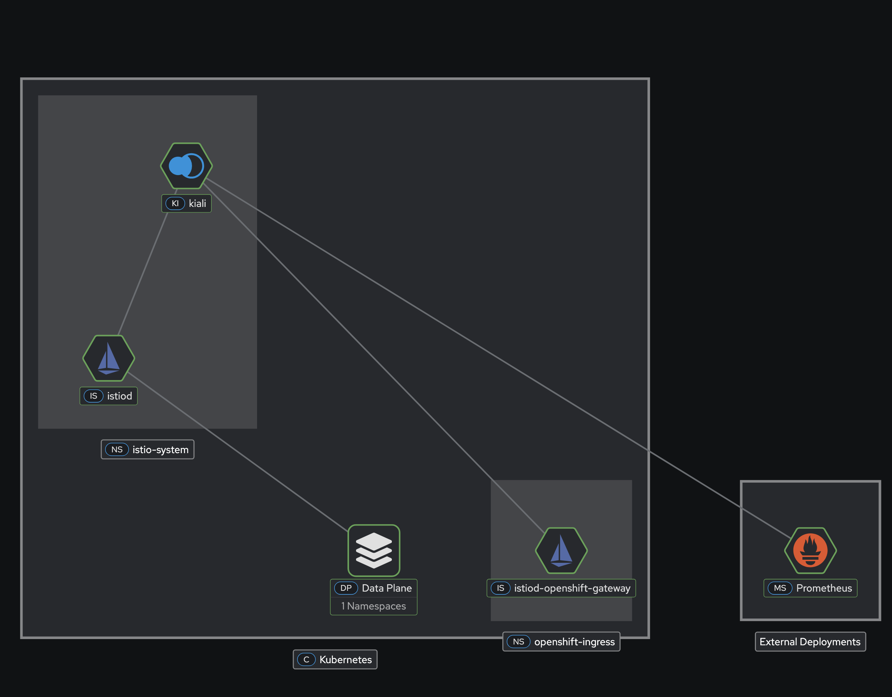
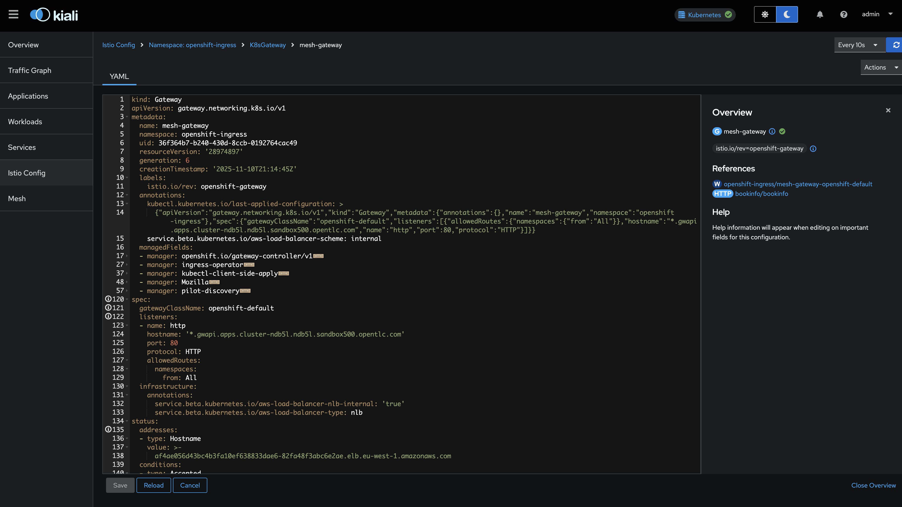
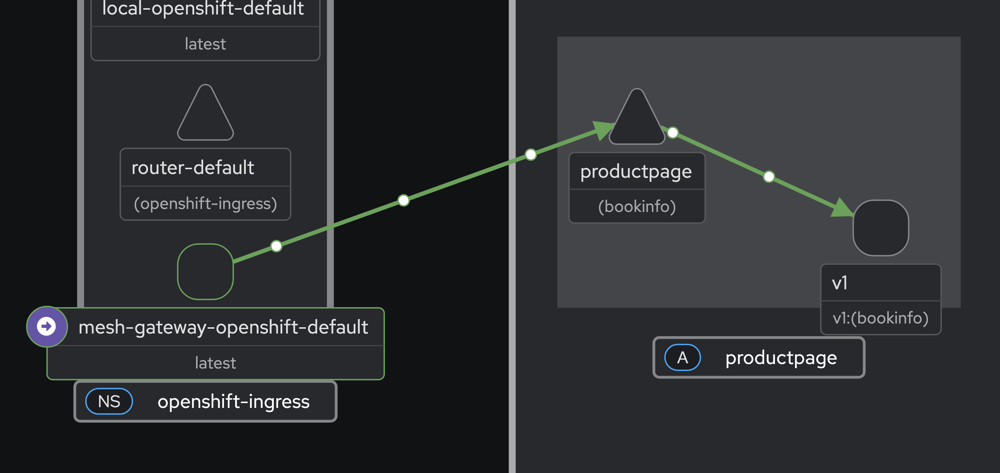
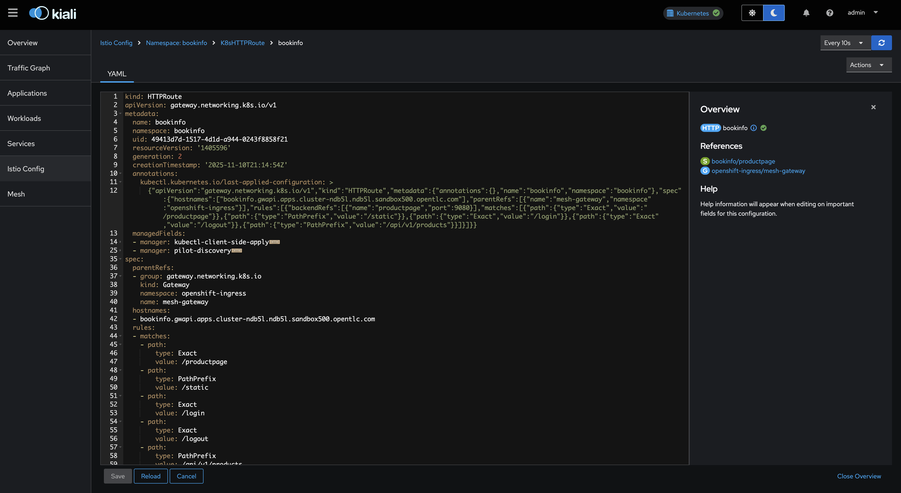

# Monitoring OpenShift Gateway API and Service Mesh with Kiali

## Unified Observability for Dual-Mesh Architecture

In our [previous post](index.md), we tackled the challenge of integrating OpenShift's Gateway API with Service Mesh by establishing a unified Certificate Authority. Now that traffic flows seamlessly between the Gateway and your mesh workloads, how do you observe it all?

This follow-up guide shows you how to configure Kiali to monitor **both** the OpenShift Gateway API components (in `openshift-ingress`) and your Service Mesh workloads—giving you a single pane of glass for your entire ingress-to-service traffic flow.

## Table of Contents

1. [Prerequisites](#prerequisites)
2. [Installing the Kiali Operator](#installing-the-kiali-operator)
3. [Understanding the Challenge](#understanding-the-challenge)
4. [Configuring Kiali for Dual-Mesh Visibility](#configuring-kiali-for-dual-mesh-visibility)
5. [Complete Kiali Configuration](#complete-kiali-configuration)
6. [Enabling Prometheus Metrics Collection](#enabling-prometheus-metrics-collection)
7. [Verification](#verification)
8. [What You Can Observe](#what-you-can-observe)

## Prerequisites

Before proceeding, ensure you have:

- Completed the [Gateway API and Service Mesh integration](index.md) setup
- Bookinfo application deployed and accessible via Gateway API
- An existing Prometheus endpoint (OpenShift's platform monitoring via `thanos-querier` or user workload monitoring)

## Installing the Kiali Operator

Install the Kiali Operator from the Red Hat catalog:

```yaml
cat <<EOF | oc apply -f -
apiVersion: operators.coreos.com/v1alpha1
kind: Subscription
metadata:
  name: kiali
  namespace: openshift-operators
spec:
  channel: stable
  installPlanApproval: Automatic
  name: kiali
  source: redhat-operators
  sourceNamespace: openshift-marketplace
EOF
```

Wait for the operator to be ready:

```bash
# Check the operator is installed
oc get csv -n openshift-operators | grep kiali
```

## Understanding the Challenge

When you deploy Kiali to monitor your Service Mesh, it faces two limitations in our dual-mesh scenario:

### 1. Namespace Discovery

By default, Kiali only discovers namespaces that match your Istio mesh's `discoverySelectors`. The `openshift-ingress` namespace—where the Gateway API runs—isn't part of your mesh, so Kiali won't see it.

### 2. GatewayClass Validation

Kiali validates Gateway API resources against known GatewayClasses. Since `openshift-default` is managed by OpenShift's Gateway controller (not your Istio), Kiali will flag it as "unknown" with a **KIA1504** validation error:

```
Gateway API Class not found in configuration
```

Both issues have simple solutions through Kiali's configuration.

## Configuring Kiali for Dual-Mesh Visibility

### Discovery Selectors: OR Logic for Namespaces

Kiali's `discovery_selectors` uses **OR logic** between array items. We can include namespaces that:

- Match your mesh label (`istio-discovery: default`), **OR**
- Are explicitly named (`openshift-ingress`)

```yaml
deployment:
  discovery_selectors:
    default:
      # Match namespaces in your Istio mesh
      - matchLabels:
          istio-discovery: default
      # OR match openshift-ingress by name
      - matchExpressions:
          - key: kubernetes.io/metadata.name
            operator: In
            values:
              - openshift-ingress
```

### Gateway API Classes: Registering OpenShift's GatewayClass

Tell Kiali about all valid GatewayClasses in your environment, including `openshift-default`:

```yaml
external_services:
  istio:
    gateway_api_classes:
      - name: Istio
        class_name: istio
      - name: OpenShift Default
        class_name: openshift-default
```

This eliminates the KIA1504 validation error for Gateway resources using `openshift-default`.

## Complete Kiali Configuration

Here's the complete Kiali CR that brings it all together:

```yaml
cat <<EOF | oc apply -f -
apiVersion: kiali.io/v1alpha1
kind: Kiali
metadata:
  name: kiali
  namespace: istio-system
spec:
  deployment:
    cluster_wide_access: true
    discovery_selectors:
      default:
        # Namespaces in the Istio mesh
        - matchLabels:
            istio-discovery: default
        # OpenShift Gateway API namespace
        - matchExpressions:
            - key: kubernetes.io/metadata.name
              operator: In
              values:
                - openshift-ingress
  
  external_services:
    grafana:
      enabled: false
    
    prometheus:
      auth:
        type: bearer
        use_kiali_token: true
      thanos_proxy:
        enabled: true
      url: https://thanos-querier.openshift-monitoring.svc.cluster.local:9091
    
    tracing:
      enabled: false
    
    istio:
      gateway_api_classes:
        - name: Istio
          class_name: istio
        - name: OpenShift Default
          class_name: openshift-default
  
  server:
    write_timeout: 60
EOF
```

Wait for Kiali to be ready:

```bash
# Check Kiali pod is running
oc get pods -n istio-system -l app=kiali

# Wait for the deployment
oc rollout status deployment/kiali -n istio-system
```

## Enabling Prometheus Metrics Collection

For Kiali to display traffic metrics, Prometheus must scrape metrics from both the Istio control plane and the Envoy sidecars. This requires deploying `ServiceMonitor` and `PodMonitor` resources in **both** namespaces:

- **`istio-system`**: Monitors istiod and mesh workload proxies
- **`openshift-ingress`**: Monitors the Gateway API proxy sidecars

### Deploy Monitoring Resources

Deploy the ServiceMonitor for istiod in `istio-system`:

```yaml
cat <<EOF | oc apply -f -
apiVersion: monitoring.coreos.com/v1
kind: ServiceMonitor
metadata:
  name: istiod-monitor
  namespace: istio-system
spec:
  targetLabels:
  - app
  selector:
    matchLabels:
      istio: pilot
  endpoints:
  - port: http-monitoring
    interval: 30s
EOF
```

Deploy the PodMonitor for Envoy proxies in `istio-system`:

```yaml
cat <<EOF | oc apply -f -
apiVersion: monitoring.coreos.com/v1
kind: PodMonitor
metadata:
  name: istio-proxies-monitor
  namespace: istio-system
spec:
  selector:
    matchExpressions:
    - key: istio-prometheus-ignore
      operator: DoesNotExist
  podMetricsEndpoints:
  - path: /stats/prometheus
    interval: 30s
    relabelings:
    - action: keep
      sourceLabels: ["__meta_kubernetes_pod_container_name"]
      regex: "istio-proxy"
    - action: keep
      sourceLabels: ["__meta_kubernetes_pod_annotationpresent_prometheus_io_scrape"]
    - action: replace
      regex: (\d+);(([A-Fa-f0-9]{1,4}::?){1,7}[A-Fa-f0-9]{1,4})
      replacement: '[\$2]:\$1'
      sourceLabels: ["__meta_kubernetes_pod_annotation_prometheus_io_port","__meta_kubernetes_pod_ip"]
      targetLabel: "__address__"
    - action: replace
      regex: (\d+);((([0-9]+?)(\.|$)){4})
      replacement: '\$2:\$1'
      sourceLabels: ["__meta_kubernetes_pod_annotation_prometheus_io_port","__meta_kubernetes_pod_ip"]
      targetLabel: "__address__"
    - sourceLabels: ["__meta_kubernetes_pod_label_app_kubernetes_io_name","__meta_kubernetes_pod_label_app"]
      separator: ";"
      targetLabel: "app"
      action: replace
      regex: "(.+);.*|.*;(.+)"
      replacement: "\${1}\${2}"
    - sourceLabels: ["__meta_kubernetes_pod_label_app_kubernetes_io_version","__meta_kubernetes_pod_label_version"]
      separator: ";"
      targetLabel: "version"
      action: replace
      regex: "(.+);.*|.*;(.+)"
      replacement: "\${1}\${2}"
    - sourceLabels: ["__meta_kubernetes_namespace"]
      action: replace
      targetLabel: namespace
    - action: replace
      replacement: "default"
      targetLabel: mesh_id
EOF
```

Deploy the ServiceMonitor for istiod in `openshift-ingress`:

```yaml
cat <<EOF | oc apply -f -
apiVersion: monitoring.coreos.com/v1
kind: ServiceMonitor
metadata:
  name: istiod-monitor
  namespace: openshift-ingress
spec:
  targetLabels:
  - app
  selector:
    matchLabels:
      istio: istiod
  endpoints:
  - port: http-monitoring
    interval: 30s
EOF
```

Deploy the same PodMonitor in `openshift-ingress` to collect Gateway proxy metrics:

```yaml
cat <<EOF | oc apply -f -
apiVersion: monitoring.coreos.com/v1
kind: PodMonitor
metadata:
  name: istio-proxies-monitor
  namespace: openshift-ingress
spec:
  selector:
    matchExpressions:
    - key: istio-prometheus-ignore
      operator: DoesNotExist
  podMetricsEndpoints:
  - path: /stats/prometheus
    interval: 30s
    relabelings:
    - action: keep
      sourceLabels: ["__meta_kubernetes_pod_container_name"]
      regex: "istio-proxy"
    - action: keep
      sourceLabels: ["__meta_kubernetes_pod_annotationpresent_prometheus_io_scrape"]
    - action: replace
      regex: (\d+);(([A-Fa-f0-9]{1,4}::?){1,7}[A-Fa-f0-9]{1,4})
      replacement: '[\$2]:\$1'
      sourceLabels: ["__meta_kubernetes_pod_annotation_prometheus_io_port","__meta_kubernetes_pod_ip"]
      targetLabel: "__address__"
    - action: replace
      regex: (\d+);((([0-9]+?)(\.|$)){4})
      replacement: '\$2:\$1'
      sourceLabels: ["__meta_kubernetes_pod_annotation_prometheus_io_port","__meta_kubernetes_pod_ip"]
      targetLabel: "__address__"
    - sourceLabels: ["__meta_kubernetes_pod_label_app_kubernetes_io_name","__meta_kubernetes_pod_label_app"]
      separator: ";"
      targetLabel: "app"
      action: replace
      regex: "(.+);.*|.*;(.+)"
      replacement: "\${1}\${2}"
    - sourceLabels: ["__meta_kubernetes_pod_label_app_kubernetes_io_version","__meta_kubernetes_pod_label_version"]
      separator: ";"
      targetLabel: "version"
      action: replace
      regex: "(.+);.*|.*;(.+)"
      replacement: "\${1}\${2}"
    - sourceLabels: ["__meta_kubernetes_namespace"]
      action: replace
      targetLabel: namespace
    - action: replace
      replacement: "default"
      targetLabel: mesh_id
EOF
```

### Verify Monitors Are Present

Confirm the monitors exist in both namespaces:

```bash
# Check ServiceMonitor and PodMonitor in istio-system
oc get servicemonitor,podmonitor -n istio-system

# Check PodMonitor in openshift-ingress
oc get podmonitor -n openshift-ingress
```
## Verification

### Access the Kiali Console



*Figure 1: Kiali Mesh Graph Overview*

Get the Kiali route:

```bash
oc get route kiali -n istio-system -o jsonpath='https://{.spec.host}'
```

Open the URL in your browser. On OpenShift, you'll authenticate with your cluster credentials.

### Verify Namespace Discovery

In the Kiali UI:

1. Navigate to **Graph** view
2. In the namespace dropdown, confirm you see both:
   - `bookinfo` (your mesh workloads)
   - `openshift-ingress` (Gateway API)

### Verify Gateway Configuration

1. Navigate to **Istio Config**
2. Select the `openshift-ingress` namespace
3. Find the `mesh-gateway` Gateway resource
4. Confirm there are **no validation errors** (no KIA1504)



*Figure 2: Kiali Gateway Configuration View*

## What You Can Observe

With Kiali properly configured, you now have visibility into:

### Traffic Flow Topology

The Graph view shows the complete request path:
```
Client → Gateway (openshift-ingress) → productpage → reviews → ratings
```


*Figure 3: Kiali Traffic Flow Topology*

### Gateway API Resources

In the Istio Config view:

- **Gateway**: `mesh-gateway` in `openshift-ingress`
- **HTTPRoute**: `bookinfo` in `bookinfo` namespace
- Both validated without errors



*Figure 4: Kiali HTTPRoute Configuration*

## Summary

| Configuration | Purpose |
|---------------|---------|
| `discovery_selectors` | Controls which **namespaces** Kiali monitors |
| `gateway_api_classes` | Controls which **GatewayClasses** Kiali validates |

By combining these two configurations, Kiali provides unified observability across your dual-mesh architecture—from the Gateway API edge all the way to your Service Mesh workloads.

## Additional Resources

- [Kiali Documentation](https://kiali.io/docs/)
- [Kiali CR Reference](https://kiali.io/docs/configuration/kialis.kiali.io/)
- [Kiali Namespace Management](https://kiali.io/docs/configuration/namespace-management/)
- [Gateway API and Service Mesh Integration](index.md)
